<h1 align="center">SkyClaw</h1>

Clawd, the Claude Code mascot, on your macOS desktop. One pixel crab for every Claude Code session, doing what that session does.

  

  <a href="docs/skyclaw.mp4">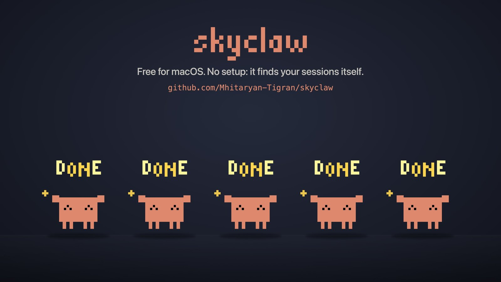</a> 
  Click for the twenty-second video

## Work

<table>
<tr><td align="center" width="200"> <b>Thinking</b> new prompt</td><td align="center" width="200"> <b>Typing</b> edits and commands</td><td align="center" width="200"> <b>Reading</b> reads and searches</td><td align="center" width="200"> <b>Wizard</b> browses the web</td></tr>
</table>
<table>
<tr><td align="center" width="200"> <b>Conducting</b> runs subagents</td><td width="200"></td><td width="200"></td><td width="200"></td></tr>
</table>

## Moments

<table>
<tr><td align="center" width="200"> <b>Happy</b> task done</td><td align="center" width="200">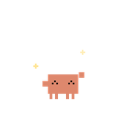 <b>High five</b> a neighbour finished</td><td align="center" width="200"> <b>Angry</b> tool failed</td><td align="center" width="200"> <b>Waiting</b> needs permission</td></tr>
</table>
<table>
<tr><td align="center" width="200"> <b>Asking</b> has a question</td><td align="center" width="200"> <b>Interrupted</b> you pressed Esc</td><td align="center" width="200"> <b>Annoyed</b> limits above 80%</td><td width="200"></td></tr>
</table>

## Idle

<table>
<tr><td align="center" width="200"> <b>Strolling</b> calm or lively</td><td align="center" width="200">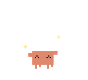 <b>Dancing</b> now and then</td><td align="center" width="200">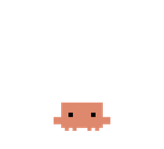 <b>Sitting</b> taking a rest</td><td align="center" width="200">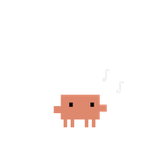 <b>Whistling</b> under rising notes</td></tr>
</table>
<table>
<tr><td align="center" width="200">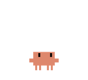 <b>Sky gazing</b> eyes up</td><td align="center" width="200">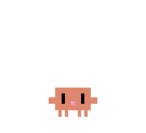 <b>Bubble gum</b> blow and pop</td><td align="center" width="200">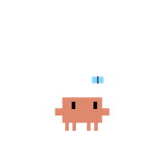 <b>Butterfly</b> eyes on it</td><td align="center" width="200"> <b>Looking</b> around, or at you</td></tr>
</table>
<table>
<tr><td align="center" width="200"> <b>Six seven</b> now and then</td><td align="center" width="200"> <b>Dozing</b> twenty quiet minutes</td><td align="center" width="200"> <b>Waking</b> work arrives</td><td width="200"></td></tr>
</table>

## Together

<table>
<tr><td align="center" width="200">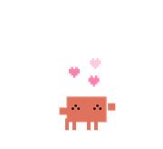 <b>Hearts</b> when two meet</td><td align="center" width="200"> <b>High five</b> when two meet</td><td align="center" width="200">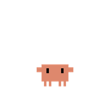 <b>Hopping</b> side by side</td><td align="center" width="200"> <b>Dancing</b> as a pair</td></tr>
</table>

## Handling

<table>
<tr><td align="center" width="200">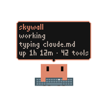 <b>Card</b> hover over him</td><td align="center" width="200"> <b>Held</b> you picked him up</td><td align="center" width="200"> <b>Flying</b> you threw him</td><td align="center" width="200"> <b>Dizzy</b> after a hard hit</td></tr>
</table>
<table>
<tr><td align="center" width="200"> <b>Hopping over</b> a Clawd in the way</td><td width="200"></td><td width="200"></td><td width="200"></td></tr>
</table>

## Play

Hover over a Clawd for his session card, double-click to jump to his terminal. Drag him, throw him at the walls and at each other, stack them up: real physics, across every monitor. Quiet 8-bit chimes tell you when a task is done or a session needs you.

## Install

Download the latest release, move SkyClaw to Applications, open it. No setup: it reads the files Claude Code already writes. It updates itself. Requires macOS 14.

An unofficial fan project, not affiliated with Anthropic. Clawd is Anthropic's mascot. MIT licensed.
