<h1 align="center">SkyClaw</h1>

Clawd, the Claude Code mascot, on your macOS desktop. One pixel crab for every Claude Code session, doing what that session does.

  

## Work

<table>
<tr><td align="center" width="25%">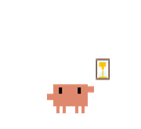 <b>Thinking</b> new prompt</td><td align="center" width="25%">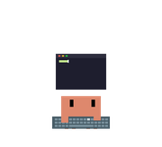 <b>Typing</b> edits and commands</td><td align="center" width="25%">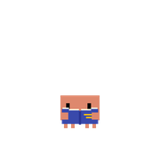 <b>Reading</b> reads and searches</td><td align="center" width="25%">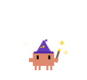 <b>Wizard</b> browses the web</td></tr>
<tr><td align="center" width="25%">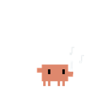 <b>Conducting</b> runs subagents</td></tr>
</table>

## Moments

<table>
<tr><td align="center" width="25%">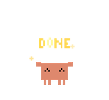 <b>Happy</b> task done</td><td align="center" width="25%">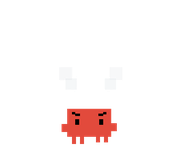 <b>Angry</b> tool failed</td><td align="center" width="25%">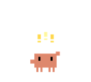 <b>Waiting</b> needs permission</td><td align="center" width="25%">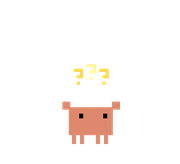 <b>Asking</b> has a question</td></tr>
<tr><td align="center" width="25%">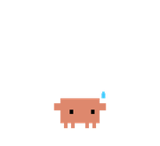 <b>Interrupted</b> you pressed Esc</td><td align="center" width="25%">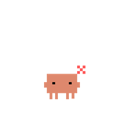 <b>Annoyed</b> limits above 80%</td></tr>
</table>

## Rest

<table>
<tr><td align="center" width="25%">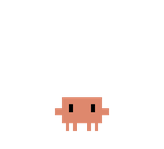 <b>Idle</b> nothing to do</td><td align="center" width="25%">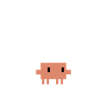 <b>Looking</b> cursor nearby</td><td align="center" width="25%">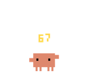 <b>Six seven</b> now and then</td><td align="center" width="25%">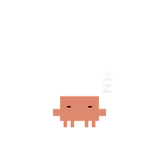 <b>Dozing</b> ten quiet minutes</td></tr>
<tr><td align="center" width="25%">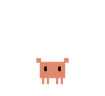 <b>Waking</b> work arrives</td></tr>
</table>

## Moving

<table>
<tr><td align="center" width="25%">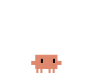 <b>Walking</b> enters and leaves</td><td align="center" width="25%">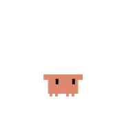 <b>Hopping</b> over a neighbour</td><td align="center" width="25%">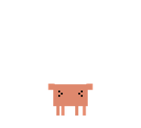 <b>Held</b> you picked him up</td><td align="center" width="25%">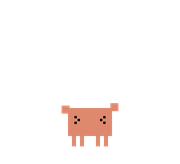 <b>Flying</b> you threw him</td></tr>
<tr><td align="center" width="25%">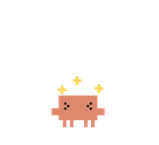 <b>Dizzy</b> after a hard throw</td></tr>
</table>

## Play

Drag him, throw him at the walls, stack one on another. Jelly or bouncy physics, three sizes, across every monitor.

## Install

Download `SkyClaw.zip` from the [latest release](https://github.com/Mhitaryan-Tigran/skyclaw/releases/latest), move SkyClaw to Applications and open it. It updates itself. Requires macOS 14.

No setup: SkyClaw finds your Claude Code sessions in the files Claude Code already writes.

An unofficial fan project, not affiliated with Anthropic. Clawd is Anthropic's mascot. MIT licensed.
